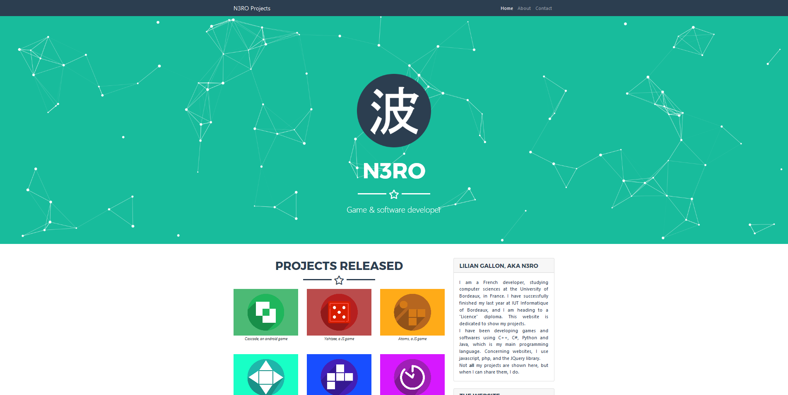

# Animated particles
  

An easy way to make your website sexy

## Important info

The first version is almost completed. Be patient :)
What is better in the version 1 :
- Full javascript (no frameworks),
- Optimized,
- Code is understandable,
- New code design (easy to add features)
- Animated particles are fully customizable,
- Documentation on how to use it in your own browser
- An some other stuff :D

## Description

I made this script to make my website look "modern". I decided to release the script to improve it from time to time. 
At the moment, the script has a lot of design issues (there are some lines that are useless, some variables that aren't relevant, and so on). I will fix it as soon as possible.

Here is an example (or you can go to this [website](https://n3roo.github.io/)):


## How to use it

### What you should know

If you use it, don't change the header of the javascript files. It should look like this :
```javascript
/**
 * GPL-3.0 License
 * Author(s) : Lilian Gallon (N3ROO), <and other contributors>, <you if you changed anything>
 * Contribute here : https://github.com/N3ROO/Animated-Particles
 */
```
However, if you put this code inside a javascript file that you made, make sure to put these informations somewhere, so it is visible.

### How to finally use it

> TODO

## Resource used

- JQuery

## TODO List

- [ ] Improve particle class design
- [ ] Improve portability (usable on any website without changing a lot of things)
- [ ] Full JS implementation (no JQuery)

## Contribution

You can contribute to improve the project as long as your code is clean. I am not a Javascript specialist, I don't know the conventions or anything. Fork the project, and make a pull request, and I will check it as soon as possible.

## Credits

- Lilian Gallon (N3ROO)
